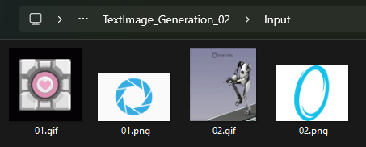

### Это проект, в котором анимированная картинка посимвольно выводится в консоль

Это выглядит вот так:

---

В своё время я был просто очарован стартовой web страницей MidJounery, там был красивый код, которым рисовалась постепенно закручивающаяся спираль

И я захотел сделать то же самое самостоятельно!

Но, так как у меня было мало свободного времени, я решил проверить на практике, действительно ли нейросети смогут заменить программистов - тогда они как раз появлялись, и все были под впечатлением от них

Я решил попросить ChatGPT написать программу полностью за меня, не вносив в неё каких-либо существенных изменений.

По итогу, проект на C# получился достаточно быстро, но моя цель - перенести его на JS в web-страницу, не увенчалась успехом. ChatGPT постоянно уводил меня в дебри исправления того или другого решения, и никак не мог предложить верное, или просто помочь разобраться, в чём же причина, по которой проект не работал

Тогда я понял, и проверил на практике, что нейрсети - это просто очень полезный инструмент программиста, а вовсе ему не замена

--- 

Как это работает: 
На вход подаётся GIF файл

Затем каждый его кадр разбивается на строки и столбцы, обрабатывается по пикселям - пиксель приводится к чёрно-белому значению, и если его значение больше 0.6, то он выводится как символ в консоли

В коде программы можно задать строчку, которая будет заполняться

---

Вот так выглядит главная страница MidJounery сейчас:

Это немного не то что было раньше, но суть похожая
